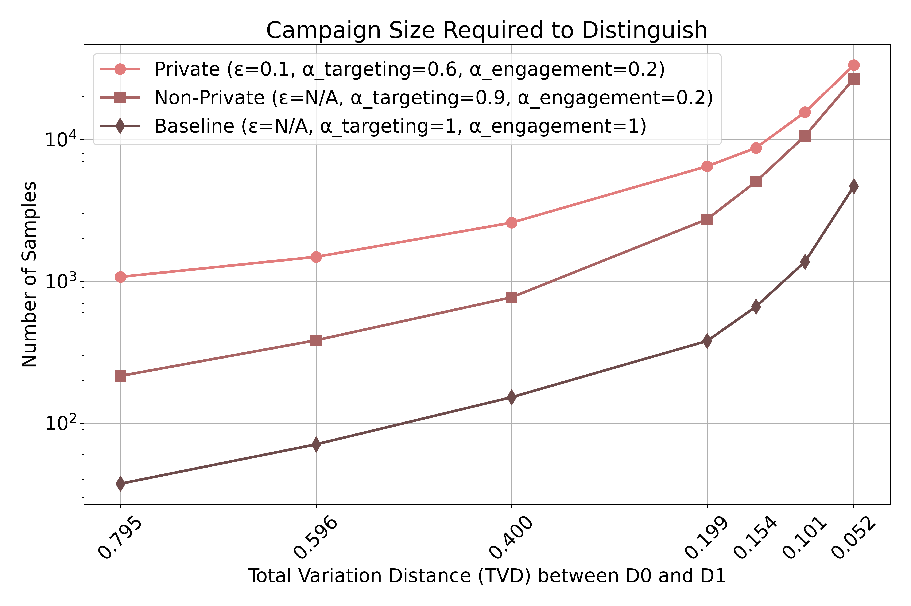

# Artifact Appendix

Paper title: **Making Sense of Private Advertising: A Principled Approach to a Complex Ecosystem**

Requested Badge(s):
  - [x] **Available**
  - [x] **Functional**
  - [x] **Reproduced**

## Description

```bibtex
@Article{PoPETS:HCKVD26,
  author    =   "Kyle Hogan and
                 Alishah Chator and
                 Gabriel Kaptchuk and
                 Mayank Varia and
                 Srinivas Devadas",
  title     =   "{Making Sense of Private Advertising: A Principled Approach to a Complex Ecosystem}",
  year      =   2026,
  volume    =   2026,
  journal   =   "{Proceedings on Privacy Enhancing Technologies}",
}
```

We provide an implementation of our ideal functionalities and generic paramaterizing functions as well as an empirical distinguishing game. 
The distinguishing game computes the sample complexity required to distingish two sample distirbutions with varying parameters for the untitlity of our functionalities and varying distances between the two distributions. 

### Security/Privacy Issues and Ethical Concerns

N/A

## Basic Requirements

### Hardware Requirements 

Can be run on commodity hardware, e.g. a laptop. However, the distinguishing game is parallelized and will run faster on a server class machine.

### Software Requirements

Expiriments were run on Ubuntu 24.04 and have not been tested on Windows or MacOS.

We provide a [Dockerfile](./Dockerfile) (Docker version 28.4.0) and [enviroment.yml](./environment.yml) (conda 23.1.0) to manage the installation of required packages.


### Estimated Time and Storage Consumption 

No substantial storage requirements (<5GB)
All experiments are computationally intensive and can take tens to hundreds of hours for larger numbers of trials. We provide a "small" option to run experiments with 10 trials as a test.

We also include example datasets in the `plots/` directory for reproducing the plots from the paper without re-running the experiemnts.

## Environment 

### Accessibility 

https://github.com/kylehogan/idealAdsFunctionalities/tree/main

### Set up the environment

On a machine running Ubuntu 20.04, 22.04, or 24.04:

First ensure that docker and git are installed.

Then, clone the repo and build the docker container:

```bash
git clone --recurse-submodules https://github.com/kylehogan/idealAdsFunctionalities.git
docker build -t idealads .
```

### Testing the Environment

To test the installation, first run the docker container:

```bash
docker run -it idealads
```

To test functionality, first reproduce one of the plots from the paper using the provided data.

Inside the Docker container, run:

```bash
 ./reproduce_plots.sh --plots-only private_v_nonprivate
```

This should reporduce the "Private vs. Nonprivate" plot as it appears in the paper.



Then, run the "small" version of one of the plots. This will only run 10 trials and should produce a plot that is not missing any lines or datapoints and generally increases in sample complexity as the alpha-epsilon value and total variation distance decrease. (requires approximately 15-20 minutes with 8 cores)

```bash
 ./reproduce_plots.sh --clean --small engagement
```


## Limitations 

The runtime for reproducing Experiment 1 and Experiment 2 can be quite long, even with a substantial number of cores. Due to the randomness of our experiements there is high variability in the number of samples requried for distinguishing and the curves on our plots do not smooth out until around 100 trials for Experiments 1 and 2 and 1000 trials for ecperiments 3 and 4. 

Fully reproducing these plots will likely take more time/cores than most people will find reasonable to dedicate. 

## Notes on Reusability 

While we used basic parametrizing functionalities and simple distirbutions in evaluating this work, both aspects are highly customizable.

For example, an alternative targeting parameterizing funtionlaities could be a click predictor model.

Additionally, more complex distributions over users could incorporate correlations over specific features of interest and align with the use of those feaures during targeting or engagement.